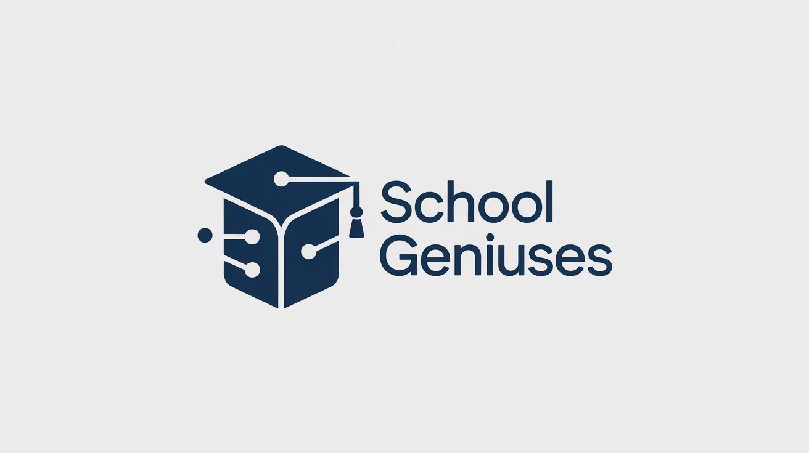

# School-Geniuses



# School Geniuses

<p align="center">
  
</p>

---

## 🧠 Introduction

**School Geniuses** is an AI-powered School Management System that allows you to
query your school data using natural language.

You can manage students, attendance, reports — and simply **ask questions like:**

> “Show students with low attendance”  
> “List students in Class 2”  

The system uses **Gemini AI** to understand queries and return meaningful results.

<p align="center">
  
</p>

---

## ✨ Features

- 🧑‍🎓 Student management  
- 🤖 AI query assistant (powered by **Gemini API**)  
- 📊 Attendance & reports  
- 🧾 QR generation for students  
- 🎛️ Simple dashboard  
- ⚙️ Django + Streamlit integration  

---

## ⬇️ Download & Setup

### 1️⃣ Clone the repository
```bash
git clone https://github.com/badarpurboom/School-Geniuses.git
cd School-Geniuses

2️⃣ Create & activate virtual environment
python -m venv venv
venv\Scripts\activate


3️⃣ Install dependencies
pip install -r requirements.txt


🔐 Gemini API Key Setup (required)

Create a file named .env in the project root and add:

GEMINI_API_KEY=your_api_key_here


You can get the key from your Google AI Studio account.

4️⃣ Run Django backend
python manage.py runserver

5️⃣ Run Streamlit AI interface
streamlit run streamlit_app.py

🎉 Your app is ready!
Open the browser and start asking questions about your school data.